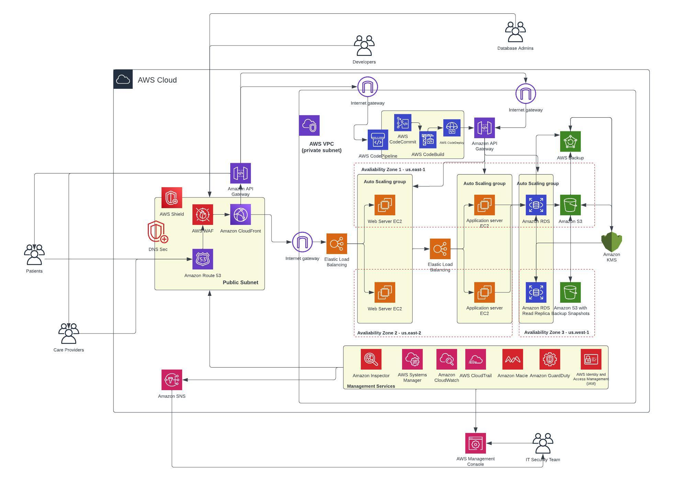
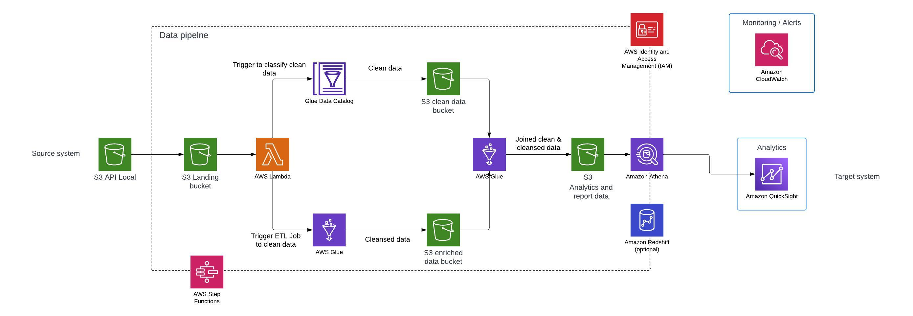
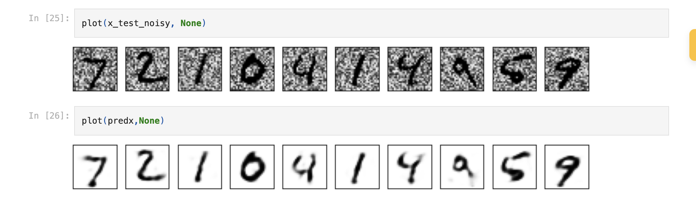

# Jitesh Majety

[**AWS Certified Developer**](https://www.credly.com/badges/bd0a5181-9ed3-4301-a913-1e6b34c9f91c/public_url)

[**IBM Certified Data Science Professional**](https://www.credly.com/badges/7e44a12f-55dc-4c7c-8c9f-7499f10aff2c/public_url)

Email: jmajety@gmail.com

Location: Hyattsville, MD  
[LinkedIn](https://www.linkedin.com/in/jitesh-majety/) | [GitHub](https://github.com/jmajety-dev) | [Resume](https://drive.google.com/file/d/1tr4Mb-mkbfjkZyLMaSJjBFZYQc0J3wyV/view?usp=sharing)

---

# About Me

Innovative Software Engineer with a strong foundation in software development, data engineering, and cloud solutions. Skilled in building big data and machine learning applications using PySpark, Python, AWS, and Terraform. Known for delivering secure, scalable solutions and streamlining processes. A dedicated, independent developer and adaptable team player, seeking roles with challenging tasks that encourage growth and development, especially in machine learning.

---

# Skills & Qualifications

**Programming Languages**: Java, C, Python, C++, Scala, HTML, CSS, JavaScript, C#, PHP, ABAP, Linux

**Frameworks**: React, Flask, Node.js, Django, PySpark, Hadoop, REST API, Terraform, Snowflake

**Tools**: ETL, Kafka, Docker, Power BI, Tableau, Hive, Autopsy, Vera-Crypt

**Databases**: MySQL, No-SQL, Firebase, AWS S3, AWS Relational Data Service

**Technical Expertise**: Git, GitHub, AWS EC2, AWS EMR, AWS Snapshots, AWS CloudFormation, AWS Airflow, Google Sheets

**Additional Skills**: Software Development, Data Analysis, Schema Design, Data Modeling, Data Maintenance, CICD, Agile Development, Version Control, Data Science, Machine Learning, Statistics, Big Data, Test Automation, Business Intelligence, Technical Writing

---

# Work Experience

### Software Engineer | Traffic Safety and Operations Lab
*University of Maryland, College Park*  
**Sept 2023 - Present**

- Developed and deployed a scalable large-scale data pipeline using **Apache Spark**, **PySpark**, **Hadoop**, and **Python** on **AWS EMR**, **AWS EC2**, and **AWS S3** to process 185 TB of geospatial data.
- Created a **Folium** map and algorithm for data cleaning, processing, and modeling over 100 TB using **AWS EMR**. Transformed data with PySpark to enhance pedestrian collision visualization for traffic engineers.
- Increased processing efficiency by transitioning to **PySpark**, reducing runtime from 1.5 hours to 4 minutes for 110 GB of data.
- Conducted data mining and modeling on multiple sources to generate 2 GB geospatial crash data for a highway safety tool.
- Built a **Flask**-based data analysis tool using **HTML**, **JavaScript**, **Python**, and **Docker** for traffic data visualization, meeting the requirement of under 3-minute processing with a 25-second runtime.

### Software Engineer | Cognizant Technology Solutions  
**Apr 2020 - Aug 2022**

- Created real-time data visualizations in **Power BI** by integrating live data from clients.
- Developed **SAP BO Data Services** jobs for data manipulation and extraction from data warehouses and **SQL** servers.
- Automated **ETL** pipelines for 100+ databases using **SQL** scripts, achieving 99% accurate real-time reporting with **Power BI** for business decision support in a Fortune 500 manufacturing company.
- Improved **CICD** workflows for 50+ ETL jobs, managing over 1000 TB of data in pipelines.

---

# Projects

### Norton Health Solution - **[Github](https://github.com/jmajety-dev/Norton-Healthcare)**
   - Implemented a secure cloud architecture for a health facility using **Terraform**, including cross-regional backups with **AWS Snapshots** and a HIPAA and PCI-compliant firewall, reducing deployment time by 30% and data recovery time by 35%.

    

### YouTube Data Analysis | Engineering Project - **[Github](https://github.com/jmajety-dev/Youtube-data-analysis-pipeline)**
   - Leveraged **Python** and **PySpark** to analyze data from 200 YouTube videos daily, providing behavioral insights into user trends. Utilized **AWS Athena**, **Glue**, **Redshift**, **S3**, **IAM**, **Lambda**, and **QuickSight** for a complete data pipeline from ingestion to visualization.

    

### Twitter Data Pipeline using Airflow
   - Developed a Twitter data storage system using **Python** and **Airflow**, utilizing **Tweepy** for data interaction, **Pandas** for data manipulation, and **AWS S3** for storage, enabling comprehensive data analysis.

### Freedemy - **[Github](https://github.com/jmajety-dev/Freedemy)**
   - Built an application using **Django**, **HTML5**, and **CSS** that increased user engagement by over 35% in 3 weeks.

### Vacation Recommender
   - Designed a recommendation website using **HTML**, **CSS**, **JavaScript**, and **MySQL**, reducing selection time for users from 30 minutes to 30 seconds. Deployed on **AWS EC2** and **AWS RDS**, improving scalability and reducing hosting costs by 20%.

### Image Denoising with AutoEncoders - **[Github](https://github.com/jmajety-dev/DeNoising-the-images-using-AutoEncoders)**
   - Developed an image denoising model in **Python** using **TensorFlow** and **OpenCV**, with a **symmetrical encoder-decoder architecture** to remove **Gaussian noise** from images.
   - Achieved **95.2% accuracy** on noisy image datasets by reconstructing clean images from noisy inputs. 
   - Key components include **Convolutional Layers** for the encoder and decoder, **Mean Squared Error (MSE)** as the loss function, and **Adam Optimizer** with a learning rate of 0.001.

    

### Economical Plaque Detection  - **[Project Report](https://drive.google.com/file/d/1LO_Vr4yhx_PNWSkRaLbFPm-bOB7A3l_4/view?usp=sharing)**
   - Developed a plaque detection algorithm in the Carotid artery with 96.8% accuracy using **CNN**, **Python**, **OpenCV**, and **Keras**.

    

---

## Education
<a id="education"><a>

- **Master of Engineering in Software Engineering**  
  *University of Maryland, College Park*  
  Graduation: **May 2024**

---
### Technical Skills

    <a href="https://www.oracle.com/java/" target="_blank" title="Java">
        <i class="fab fa-java" style="font-size: 2em;"></i>
    </a>
    <a href="https://www.python.org/" target="_blank" title="Python">
        <i class="fab fa-python" style="font-size: 2em; color: #4B8BBE;"></i>
    </a>
    <a href="https://developer.mozilla.org/en-US/docs/Web/JavaScript" target="_blank" title="JavaScript">
        <i class="fab fa-js-square" style="font-size: 2em; color: #F7DF1E;"></i>
    </a>
    <a href="https://developer.mozilla.org/en-US/docs/Web/HTML" target="_blank" title="HTML">
        <i class="fab fa-html5" style="font-size: 2em; color: #E34F26;"></i>
    </a>
    <a href="https://developer.mozilla.org/en-US/docs/Web/CSS" target="_blank" title="CSS">
        <i class="fab fa-css3-alt" style="font-size: 2em; color: #1572B6;"></i>
    </a>
    <a href="https://www.php.net/" target="_blank" title="PHP">
        <i class="fab fa-php" style="font-size: 2em; color: #777BB4;"></i>
    </a>
        <a href="https://www.terraform.io/" target="_blank" title="Terraform">
    <!-- Terraform icon with brand color -->
    </a>
    <a href="https://www.linux.org/" target="_blank" title="Linux">
        <i class="fab fa-linux" style="font-size: 2em; color: #FCC624;"></i>
    </a>
    <a href="https://reactjs.org/" target="_blank" title="React">
        <i class="fab fa-react" style="font-size: 2em; color: #61DAFB;"></i>
    </a>
    
    <a href="https://aws.amazon.com/" target="_blank" title="AWS">
        <i class="fab fa-aws" style="font-size: 2em; color: #FF9900;"></i>
    </a>
    <!--  -->
    <!-- 
    
     -->
    <!-- 
    
    
     -->
    
    <a href="https://www.mysql.com/" target="_blank" title="SQL Database">
        <i class="fas fa-database" style="font-size: 2em; color: #4479A1;"></i>
    </a>
    <a href="https://www.mongodb.com/" target="_blank" title="NoSQL Database">
        <i class="fas fa-database" style="font-size: 2em; color: #4DB33D;"></i>
    </a>
    <a href="https://nodejs.org/" target="_blank" title="Node.js">
        <i class="fab fa-node-js" style="font-size: 2em; color: #68A063;"></i>
    </a>
    <a href="https://hadoop.apache.org/" target="_blank" title="Hadoop">
        <i class="fab fa-hubspot" style="font-size: 2em;"></i>
    </a>
    <a href="https://www.docker.com/" target="_blank" title="Docker">
        <i class="fab fa-docker" style="font-size: 2em; color: #2496ED;"></i>
    </a>
    <a href="https://kubernetes.io/" target="_blank" title="Kubernetes">
        <i class="fas fa-cubes" style="font-size: 2em; color: #326CE5;"></i>
    </a>
    <a href="https://firebase.google.com/" target="_blank" title="Firebase">
        <i class="fas fa-fire-alt" style="font-size: 2em; color: #FFCA28;"></i>
    </a>
    <a href="https://git-scm.com/" target="_blank" title="Git">
        <i class="fab fa-git" style="font-size: 2em; color: #F05032;"></i>
    </a>
    <a href="https://github.com/" target="_blank" title="GitHub">
        <i class="fab fa-github" style="font-size: 2em; color: #dbd5d5;"></i>
    </a>

---

## Connect with Me
- **LinkedIn**: [linkedin.com/in/jitesh-majety](https://www.linkedin.com/in/jitesh-majety/)
- **GitHub**: [github.com/jmajety-dev](https://github.com/jmajety-dev)
- **Email**: [jmajety@gmail.com](mailto:jmajetygmail.com)
<!-- - **Portfolio**: [jmajety-dev.github.io](http://jmajety-dev.github.io/) -->

Thank you for visiting! Feel free to explore my projects and connect for any collaboration opportunities or inquiries.
